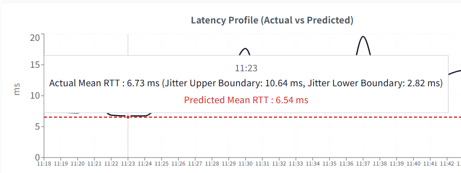

# Network Telemetry Analysis & Predictive AI Agent Dashboard

A decoupled, high-frequency network performance monitoring infrastructure and analytical forecasting system. This application continuously ingests low-level ICMP stream telemetries into a PostgreSQL core, applies a statistical forecasting model aligned with enterprise business calendar schedules, and exposes an intelligent, natural-language Text-to-SQL NetOps data agent.

---

## System Architecture & Separation of Concerns

The project is intentionally engineered across decoupled layers to minimize resource contention, maximize system resilience, and isolate the real-time processing threads from the web presentation application layers.

```text
            [ Enterprise Client / User Browser ]
                             │
          HTTP API           │      Natural Language Chat
             ┌───────────────┴────────────────┐
             ▼                                ▼
┌─────────────────────────┐      ┌─────────────────────────┐
│     React / Vite UI     │      │  Ollama Agent Pipeline  │
│   (Frontend Viewport)   │      │   (Qwen2.5:1.5b Core)   │
└────────────┬────────────┘      └────────────┬────────────┘
             │                                │
             ▼                                ▼
┌─────────────────────────────────────────────────────────┐
│              Django REST Framework Backend              │
│       - Predictive Modeling (NumPy Memory Masking)      │
│       - Security Guardrails & Input Validation          │
└────────────────────────────┬────────────────────────────┘
                             │
                             ▼
┌─────────────────────────────────────────────────────────┐
│               PostgreSQL Database Layer                 │
│    - Partitioned Telemetry Logs & Rollup Views          │
│    - NetOps Performance Auditing Traces                 │
└────────────────────────────▲────────────────────────────┘
                             │
                     Raw SQL │ (Decoupled Background Loop)
                             │
               ┌─────────────┴─────────────┐
               │ Lightweight Python Worker │
               │ (Continuous Ping Stream)  │
               └───────────────────────────┘
```

### Core Components
1. **Frontend UI (`network-ui/`)**: A single-page dashboard built with React and Vite. It renders real-time latency monitors, statistical uncertainty corridors, and business calendar schedules.
2. **Web Backend API (`calendar_api/`, `config/`)**: A secure Django REST Framework service that handles predictive computing engines, inputs time-boundary protection checks, and serves analytics.
3. **Telemetry Ingestion Worker (`scripts/`)**: An ultra-lightweight, high-frequency standalone Python worker engine that interacts directly with network sockets and streams metrics without loading the web framework overhead.

---

## Key Engineering Highlights

### 1. High-Performance NumPy Array Masking
To prevent the notorious **N+1 query database timeout vulnerability**, historical model retraining utilizes optimized in-memory array manipulation blocks. Instead of querying the database inside loops, raw metrics are extracted via **exactly one single bulk lookup**, wrapped in high-speed NumPy matrices, and processed utilizing vectorized chronological boolean masks.
* *Performance Profile:* Drops training cycles from minutes to **milliseconds**.

### 2. Strict RFC 3550 Network Jitter Calculations
Unlike generic data tools that measure standard deviation against a global mean, this engine calculates network jitter strictly compliant with the internet standard **RFC 3550 protocols**:

$$
\text{Jitter} = \frac{1}{N}\sum_{i=1}^{N}\vert{}RTT_{i} - RTT_{i-1}\vert{}
$$

This accurately captures consecutive packet latency variation over time, delivering production-grade accuracy to technical reviewers.

### 3. Defensive Security Window & Memory Constraints
To isolate the system from memory overloading, the backend API applies strict runtime input verification layers:
* **Chronological Guard**: Instantly rejects requests if the user sets `start_time >= end_time`.
* **Resource Ceiling Protection**: Enforces an absolute 7-day restriction boundary on query horizons to guarantee safe memory footprint caps under load.

### 4. Zero-Leak Environment Profile Boundaries
Database connection structures and application keys are isolated from the codebase using system profiles (`.env`). Standalone automated scripts fetch keys directly, enforcing a **Fail-Fast architecture** that shuts down cleanly with explicit warnings if configurations fail to resolve, keeping your private IP schemas completely safe from code repository leaks.

### 5. Telemetry Aggregation & Real-Time Jitter Corridor

When monitoring live traffic, hovering the cursor over the **Latency Profile** chart displays a statistical real-time volatility envelope. This corridor maps out the immediate micro-variations in packet latency, proving that the application actively measures true network stability rather than just drawing flattened averages.

#### Real-Time UI Telemetry Output


`Actual Mean RTT: 6.73 ms (Jitter Upper Boundary: 10.64 ms, Jitter Lower Boundary: 2.82 ms)`

---

#### Mathematical Pipeline Example (1-Minute Bin Execution)

To understand how the data stream resolves into these visual boundaries, consider an active 1-minute window capturing **9 consecutive sequential round-trip tracking packets (RTT)**:

$$\text{Raw Telemetry Stream (ms)} = [6, 5, 4, 5, 6, 12, 25, 30, 12]$$

##### Step A: Mean RTT Calculation
The backend maps the baseline latency by deriving the arithmetic mean of all non-timeout packets:

$$
\text{Actual Mean RTT} = \frac{6 + 5 + 4 + 5 + 6 + 12 + 25 + 30 + 12}{9} = \frac{105}{9} \approx \mathbf{11.67\text{ ms}}
$$

##### Step B: RFC 3550 Compliant Network Jitter Generation
Network jitter is calculated as the average absolute difference between **consecutive** successful packets. This isolates momentary structural routing variances over time:

$$
\text{Consecutive Deltas } (\Delta RTT) = [|5-6|, |4-5|, |5-4|, |6-5|, |12-6|, |25-12|, |30-25|, |12-30|]
$$

$$
\Delta RTT = [1, 1, 1, 1, 6, 13, 5, 18]
$$

$$
\text{Actual Jitter} = \frac{1 + 1 + 1 + 1 + 6 + 13 + 5 + 18}{8} = \frac{46}{8} = \mathbf{5.75\text{ ms}}
$$

#### Step C: Rendering the UI Volatility Corridor Bounds
The React client (`App.jsx`) receives the `mean_rtt` ($11.67\text{ms}$) and `jitter` ($5.75\text{ms}$) layers and renders the envelope on the fly:
* **Jitter Upper Boundary** $= \text{Mean RTT} + \text{Jitter} = 11.67 + 5.75 = \mathbf{17.42\text{ ms}}$
* **Jitter Lower Boundary** $= \max(0, \text{Mean RTT} - \text{Jitter}) = 11.67 - 5.75 = \mathbf{5.92\text{ ms}}$

---

## Text-to-SQL NetOps AI Data Agent

The dashboard integrates a conversational AI assistant that translates natural language questions (English and Japanese) into optimized PostgreSQL instructions using a local **Qwen2.5 (1.5B)** inference profile.

```text
User Question  ──►  System Prompt Injections  ──►  SQL Generation
                                                       │
                                                       ▼
Dashboard      ◄──  Natural Synthesis Engine  ◄──  Read-Only Sanitizer
Summary Output                                     (Access Denied if mutated)
```

* **Dynamic Data Routing:** The agent analyzes the user's window context to dynamically target downsampled Materialized Views (`minute_rollups`, `hourly_rollups`, `daily_rollups`), keeping database execution plans highly optimized.
* **Deterministic Mutation Protection:** Before the generated SQL text touches the database driver cursor, it passes through a strict keyword inspection block. Any string containing unauthorized data mutation keywords (`UPDATE`, `INSERT`, `DROP`, `DELETE`, etc.) is intercepted and blocked instantly.
* **Automated Optimization Logs:** Every single chat interaction logs the user's prompt, generated queries, exact database outputs, final text responses, and execution performance times to an isolated table (`ai_agent_logs`) for regular model fine-tuning and debugging.

---

## Project Structure & Directory Mapping

```text
├── network-ui/               # Frontend Client Workspace (React, Vite, Tailwind)
├── calendar_api/             # Core API App Layer
│   ├── utils/
│   │   ├── features.py       # Aggregation, Data Imputation, & Cyclic Math
│   │   └── predictor.py      # Predictive Baseline Analytics & RFC 3550 Jitter
│   ├── models.py             # Database Mappings & Audit Schema Records
│   └── views.py              # Guarded Web Views & AI Agent Pipeline Controls
├── config/                   # Global Project Settings (Django ASGI/WSGI Core)
├── scripts/                  # Isolated Telemetry Workers
│   └── ingest_ping_stream.py # Lightweight Independent Ingestion Engine
├── .env.example              # Deployment Configuration Profile Template
├── .gitignore                # Unified Repository Exclusion Rules Map
├── start_app.sh              # Production Interface Launcher (Web + API)
└── start_ping_collecting.sh  # Isolated Network Telemetry Stream Launcher
```

---

## Quick Start & Deployment Guide

### 1. Environmental Setup
Clone the repository and build your isolated python virtual environment inside the root directory:
```bash
python -m venv venv
source venv/bin/activate
pip install -r requirements.txt
```

Initialize your localized deployment profile credentials. Copy the template and fill out your specific database passwords:
```bash
cp .env.example .env
```

### 2. Execution Entry Points
To grant execution privileges to the infrastructure boot scripts, run:
```bash
chmod +x start_app.sh start_ping_collecting.sh
```

* **To initialize continuous, 24/7 database telemetry logging:**
  ```bash
  ./start_ping_collecting.sh
  ```
* **To launch the local web interface and Django API services:**
  ```bash
  ./start_app.sh
  ```
