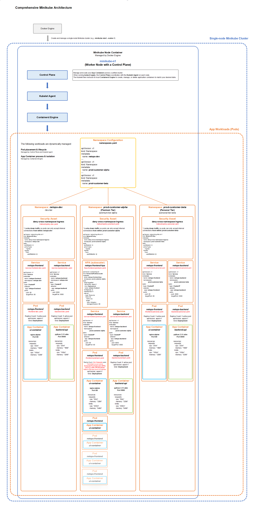
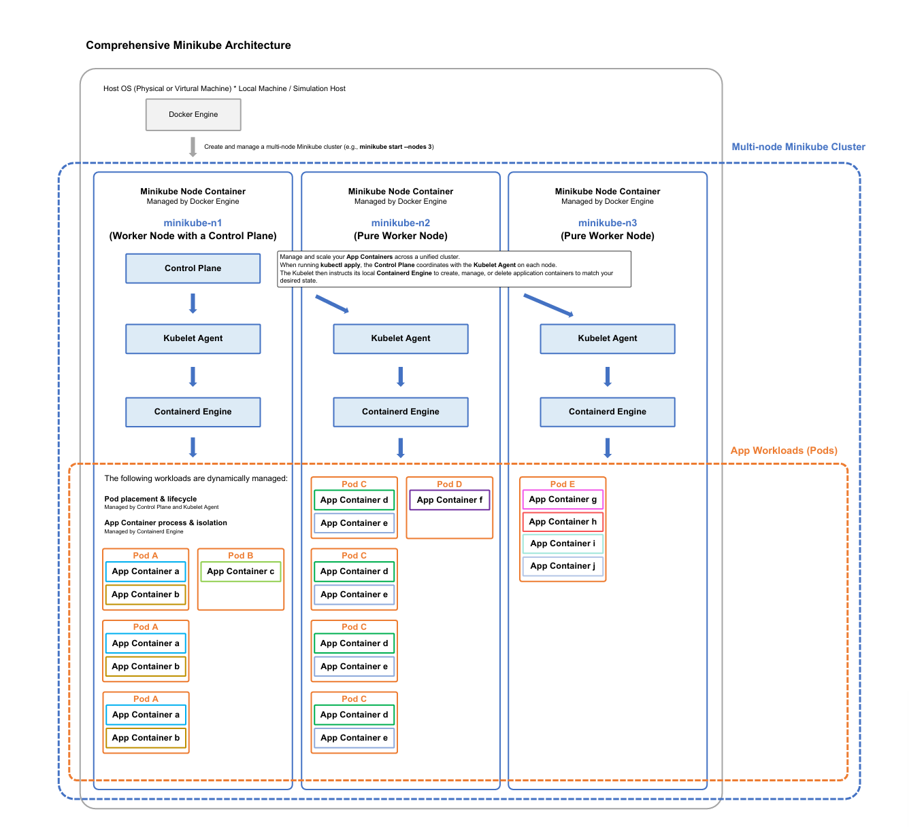
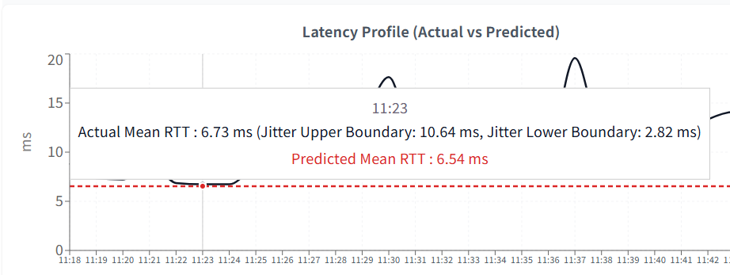

# AI NetOps Query Agent & Network Telemetry Analytics Platform

A natural-language query agent for network telemetry: ask plain-English (or Japanese) questions about live latency, jitter, and packet loss, and get an answer synthesized from a live Cube.js semantic layer — backed by a multi-tier LLM cascade with automatic fallback. The same platform continuously ingests low-level ICMP stream telemetry into PostgreSQL and layers a statistical forecasting model on top, aligned with a business calendar schedule.

---

## Demo: AI NetOps Chat Agent

<video src="https://github.com/user-attachments/assets/e2e82014-5992-44c3-b967-86d7ed26c057" controls width="700"></video>

This is a network telemetry and analytics platform with a natural-language query interface. The engine ingests real-time raw telemetry streams, processing and rendering time-series metrics onto a unified React dashboard layout.

We can query the system natively via our natural-language data agent. Let's ask for the peak minutely average latency on a specific date. We target the query using a descriptive alias, `R1_DGW`, instead of a raw IP address — the underlying node's IP never appears in the prompt, the LLM's context, or the request logs.

The agent translates the question into a Cube.js semantic query, not raw SQL, so there's no SQL-injection surface to defend in the first place. A RAG layer retrieves the relevant business-metric vocabulary — embedded once per process, matched by cosine similarity — to ground the translation, which is then routed through a cascading multi-LLM architecture that defaults to a commercial API and falls back to offline local inference if it's unavailable.

The agent resolves the query end-to-end — LLM translation, Cube.js dispatch, and local synthesis chained across three network calls — in around 30+ seconds. Cross-referencing our time-series profile verifies the data: the actual mean RTT spikes to exactly 39.47 milliseconds at 15:09 JST.

---

## Infrastructure Migration Simulation: AWS EKS → GCP GKE

`infrastructure-simulation/` is a local, cost-free simulation of a tiered multi-tenant Kubernetes deployment — Namespaces, Deployments, Services, NetworkPolicies, and a HorizontalPodAutoscaler — run on Minikube to validate the manifest design before spending on a real EKS or GKE cluster.

### Tiered Multi-Tenant Namespace Isolation

| Layer | Premium (`prod-customer-alpha`) | Personal (`prod-customer-beta`) | Internal Dev (`netops-dev`) |
|---|---|---|---|
| Frontend replicas | 2–5, autoscaled on CPU (`HorizontalPodAutoscaler`) | 1 (fixed, by design — no scaling for single-user tier) | 1 (fixed) |
| Backend replicas | 1 | 1 | 1 |
| Load balancing | `Service` (ClusterIP) across all frontend replicas | `Service` (ClusterIP) | `Service` (ClusterIP) |
| Network isolation | `NetworkPolicy`, denies cross-namespace ingress — verified: cross-namespace `wget` times out | Same | Same — dev is isolated from both customer tenants, and they from it |
| Node spreading | `podAntiAffinity` (effective with `minikube start --nodes=2+`) | Not applicable — single replica | Not applicable |

`netops-dev` represents the SaaS provider's own internal development/staging environment — distinct from both customer tenant namespaces, and isolated from them the same way they're isolated from each other, so neither real customer traffic nor in-progress dev work can cross that boundary.

### Production-readiness checklist

What's actually in place vs. deliberately deferred:
- ✅ Resource requests/limits on every container
- ✅ Liveness/readiness probes
- ✅ Real network isolation (`NetworkPolicy`, confirmed via cross-namespace connectivity test)
- ✅ Load-balanced frontend (`Service`, confirmed via `Endpoints` listing all replica IPs)
- ✅ CPU-based autoscaling on the premium tier (`HorizontalPodAutoscaler`)
- ❌ Real application images — Deployments currently run placeholder containers (`nginx:alpine`, a Python stub serving a tier-identity JSON) rather than the actual Django/React app; no Dockerfile exists yet for either
- ❌ Ingress/TLS, Secrets management, persistent storage — not yet ported to this cluster

### What Minikube does and doesn't simulate

The Kubernetes objects above (`Namespace`/`Deployment`/`Service`/`NetworkPolicy`/`HPA`) are identical whether the cluster is Minikube, EKS, or GKE — that portability is the point of the exercise. What's cloud-specific and *not* simulated here:

| Concern | AWS (EKS) | GCP (GKE) |
|---|---|---|
| Ingress / load balancing | AWS Load Balancer Controller, ALB | GKE Ingress, Cloud Load Balancing |
| Workload identity | IAM Roles for Service Accounts | Workload Identity |
| Storage class | EBS CSI (`gp3`) | GCE PD CSI (`pd-balanced`) |
| Managed DB equivalent | RDS | Cloud SQL |

### Diagram: this simulation's actual topology



Namespace-by-namespace breakdown of every object actually defined in `infrastructure-simulation/` — exact `apiVersion`/`kind`/`metadata`, resource `requests`/`limits` per tier, and the HPA's real `minReplicas`/`maxReplicas`/CPU threshold. Not yet depicted: the `podAntiAffinity` block on the premium frontend and the readiness/liveness probes (planned for a future update to this diagram) — see the actual YAML files in `infrastructure-simulation/` for those in the meantime.

### Background reference: how Minikube works (general)



A generic, textbook-style diagram of Minikube's internals (multi-node cluster, Control Plane, Kubelet, Containerd, generic pod scheduling).

**This diagram is not a depiction of this project's actual architecture.** It shows a generic multi-node cluster with placeholder pods — this simulation itself runs on a single node by default, with the specific namespaces, Deployments, and Services depicted accurately in the diagram above and described in "Tiered Multi-Tenant Namespace Isolation" earlier in this section. For the real topology, use those, not this generic diagram.

### Running it locally

```bash
minikube start --driver=docker
minikube addons enable metrics-server

kubectl apply -f infrastructure-simulation/namespaces.yaml
kubectl apply -f infrastructure-simulation/premium-tier-alpha/
kubectl apply -f infrastructure-simulation/personal-tier-beta/
kubectl apply -f infrastructure-simulation/dev-tier/
```

### Verifying the claims above

```bash
# load-balancing: confirm all 3 premium replicas are registered
kubectl get endpoints netops-frontend -n prod-customer-alpha

# network isolation: cross-namespace request should time out
kubectl exec -n prod-customer-alpha deploy/netops-frontend -- \
  wget -T 3 -qO- $(kubectl get pod -n prod-customer-beta -l app=netops-frontend -o jsonpath='{.items[0].status.podIP}')

# autoscaling: watch replica count respond to generated load
kubectl get hpa -n prod-customer-alpha -w
```

---

## System Architecture & Separation of Concerns

The project is intentionally engineered across decoupled layers to minimize resource contention, maximize system resilience, and isolate the real-time processing threads from the web presentation application layers.

```text
            [ Enterprise Client / User Browser ]
                             │
          HTTP API           │      Natural Language Chat
             ┌───────────────┴────────────────┐
             ▼                                ▼
┌─────────────────────────┐      ┌─────────────────────────┐
│     React / Vite UI     │      │  Ollama Agent Pipeline  │
│   (Frontend Viewport)   │      │   (Qwen2.5:1.5b Core)   │
└────────────┬────────────┘      └────────────┬────────────┘
             │                                │
             ▼                                ▼
┌─────────────────────────────────────────────────────────┐
│              Django REST Framework Backend              │
│    - AI Query Agent (LLM Cascade + Cube.js Dispatch)    │
│      - Statistical Forecasting (vectorized aggregation) │
│       - Security Guardrails & Input Validation          │
└────────────────────────────┬────────────────────────────┘
                             │
                             ▼
┌─────────────────────────────────────────────────────────┐
│               PostgreSQL Database Layer                 │
│    - Partitioned Telemetry Logs & Rollup Views          │
│    - NetOps Performance Auditing Traces                 │
└────────────────────────────▲────────────────────────────┘
                             │
                     Raw SQL │ (Decoupled Background Loop)
                             │
               ┌─────────────┴─────────────┐
               │ Lightweight Python Worker │
               │ (Continuous Ping Stream)  │
               └───────────────────────────┘
```

### Core Components
1. **Web Backend API (`calendar_api/`, `config/`)**: A Django REST Framework service that hosts the multi-tier AI query agent, a lightweight statistical forecasting engine, and time-boundary/input validation.
2. **Frontend UI (`network-ui/`)**: A single-page dashboard built with React and Vite. It renders the NetOps chat agent, real-time latency monitors, statistical uncertainty corridors, and business calendar schedules.
3. **Telemetry Ingestion Worker (`scripts/`)**: An ultra-lightweight, high-frequency standalone Python worker that interacts directly with network sockets and streams metrics without loading the web framework overhead.

---

## Text-to-Query NetOps AI Data Agent

The dashboard integrates a conversational AI assistant that translates natural language questions (English and Japanese) into a Cube.js semantic query, executes it against the rollup views, and synthesizes a plain-language answer.

```text
User Question ──► Anonymizer ──► LLM Cascade ──► Cube.js Query JSON
              (IP masking)   (Gemini → Remote GPU → Local Ollama)
                                                       │
                                                       ▼
Dashboard  ◄── Synthesis (Ollama qwen2.5:1.5b) ◄── Cube.js (read-only aggregate query)
Answer                                                │
                                                       ▼
                                          ai_agent_logs (full audit trail)
```

* **Multi-tier LLM cascade with graceful degradation:** each request is attempted through `cascade_llm_router` in order — a cloud-hosted Gemini 3.5 Flash Lite tier, a private remote-GPU Llama 3.1 tier (reached over an auto-managed SSH tunnel), and a local Ollama Qwen2.5:1.5B tier — falling through to the next tier on failure, timeout, or malformed JSON, so the agent keeps working even if a paid API key or the GPU box is unavailable.
* **Anonymization before anything leaves the process:** IPv4 addresses in the user's question are masked into per-request tokens (`TARGET_NODE_1`, ...) before the question is sent to any LLM or written to a log line, and are only resolved back to real IPs when building the final Cube.js filter (`anonymizer.py`).
* **Structurally read-only:** the LLM only ever produces a Cube.js query object (measures/dimensions/filters) — there is no raw-SQL generation path, so there's nothing to sanitize for mutation keywords in the first place.
* **Dynamic data routing:** the agent targets the appropriate rollup view (`minute_rollups`, `hourly_rollups`, `daily_rollups`) based on the requested time window.
* **Stage-level observability:** each request is timed independently at the LLM-routing, Cube-dispatch, and Ollama-synthesis stages (`time.perf_counter`), plus total request latency and process RSS memory, all emitted through structured logger output.
* **Full interaction logging:** every chat exchange (prompt, resolved query, DB output, response, latency) is written to `ai_agent_logs` for later review.
* **RAG-based semantic catalog retrieval:** `semantic_catalog.py` defines a business-term → technical-metric mapping (e.g. "high latency" → `PingLogs.highestRtt`). Rather than statically dumping the whole catalog into every prompt, `rag.py` embeds each catalog entry and the incoming question (Gemini `gemini-embedding-001`, asymmetric `RETRIEVAL_DOCUMENT`/`RETRIEVAL_QUERY` embeddings), ranks by cosine similarity, and injects only the relevant subset — falling back to the full catalog if embedding fails for any reason.

---

## Data & Semantic Architecture

The chat agent and dashboard are both served from the same pre-aggregated data layer:

```text
Raw table: ping_logs(ts, target_id, rtt_ms, is_timeout)
Rollup views:
  - minute_rollups(ts_minute, target_id, highest_rtt, mean_rtt, ...)
  - hourly_rollups(ts_hour, target_id, highest_rtt, mean_rtt, ...)
  - daily_rollups(ts_day, target_id, highest_rtt, mean_rtt, ...)
```

* Pre-aggregation reduces query load and keeps interactive response times low for both the dashboard and the chat agent.
* Cube.js exposes these rollups as a semantic layer (`PingLogs.highestRtt`, `PingLogs.meanRtt`, `PingLogs.packetLossRate`, `Targets.ip`) so the LLM only needs to reason about business-level measures, never raw SQL.
* Supports both raw event-level analysis and business-level summaries, and keeps the platform scalable and easy to debug.

---

## Additional Engineering Notes

* **Request window validation:** the API rejects requests where `start_time >= end_time` and caps query windows to 12 hours to bound memory usage during aggregation.
* **Environment isolation:** database credentials and API keys live outside the codebase in `.env`; the app fails fast at startup if a required variable is missing. Admin-only actions (editing calendar events, retraining the model, running maintenance) are enforced server-side via a JWT issued after a password check.
* **NumPy array masking for baseline training:** to avoid an N+1 query pattern during model retraining, historical metrics are fetched in a single bulk query and sliced per event using vectorized boolean masks instead of querying the database inside a loop.

### Known Gaps
* `google-genai` is now a load-bearing dependency (pinned in `requirements.in`) — it backs both the Gemini Tier 1 LLM cascade and the RAG catalog-retrieval embeddings, so it's required on a fresh install, not just an optional fallback path.
* Telemetry ingestion and the baseline predictor currently target a single hardcoded node (`target_id=1`); the schema (`Targets` table, Cube.js `Targets` cube) supports multiple targets, but target selection isn't yet exposed in the UI/API.

---

## Predictive Modeling & Jitter Corridor

Hovering over the **Latency Profile** chart shows the RTT ± jitter envelope for that minute bucket, rather than a flattened average. Jitter is computed per RFC 3550 — the mean absolute difference between consecutive RTT samples:

$$
\text{Jitter} = \frac{1}{N}\sum_{i=1}^{N}\vert{}RTT_{i} - RTT_{i-1}\vert{}
$$



`Actual Mean RTT: 6.73 ms (Jitter Upper Boundary: 10.64 ms, Jitter Lower Boundary: 2.82 ms)`

A lightweight statistical baseline (per-event-category mean RTT/jitter/loss coefficients, `predictor.py`) is trained from historical logs and used to forecast the remainder of the day by overlaying those coefficients on upcoming calendar events.

---

## Project Structure & Directory Mapping

```text
├── network-ui/                 # Frontend Client Workspace (React, Vite, Tailwind)
├── calendar_api/               # Core API App Layer
│   ├── utils/
│   │   ├── llm_router.py       # LLM routing and fallback logic
│   │   ├── semantic_catalog.py # Business-term/metric catalog (retrieved via rag.py)
│   │   ├── rag.py              # Gemini-embedding RAG retrieval over the semantic catalog
│   │   ├── features.py         # Aggregation, data imputation, cyclic math
│   │   └── predictor.py        # Baseline analytics and RFC 3550 jitter
│   ├── models.py               # Database mappings and audit schema
│   ├── serializers.py          # REST serializers
│   ├── permissions.py          # Admin-JWT write-access guard
│   ├── urls.py                 # Django API routing
│   ├── views.py                # Guarded web views and AI query pipeline
│   └── apps.py                 # App initialization and remote GPU tunnel setup
├── cube/                       # Cube.js semantic layer service
│   ├── docker-compose.yml      # Cube Core container definition
│   └── schema/                 # Cube.js data model (measures/dimensions)
├── config/                     # Global project settings (Django ASGI/WSGI)
│   └── urls.py
├── scripts/                    # Isolated telemetry workers
│   └── ingest_ping_stream.py   # Lightweight independent ingestion engine
├── infrastructure-simulation/  # Vendor-neutral Kubernetes topology simulation (Minikube validation)
├── .env.example                # Deployment configuration template
├── .gitignore                  # Repository ignore rules
├── requirements.txt            # Python dependencies
├── start_app.sh                # Local dev launcher (Django dev server + Vite dev server)
└── start_ping_collecting.sh    # Isolated telemetry stream launcher
```

---

## Local Development Setup

### 1. Environmental Setup
Clone the repository and build your isolated python virtual environment inside the root directory:
```bash
python -m venv venv
source venv/bin/activate
pip install -r requirements.txt
```

Initialize your localized deployment profile credentials. Copy the template and fill out your specific database passwords:
```bash
cp .env.example .env
```

### 2. Execution Entry Points
To grant execution privileges to the infrastructure boot scripts, run:
```bash
chmod +x start_app.sh start_ping_collecting.sh
```

* **To initialize continuous, 24/7 database telemetry logging:**
  ```bash
  ./start_ping_collecting.sh
  ```
* **To launch the local web interface and Django API services:**
  ```bash
  ./start_app.sh
  ```
